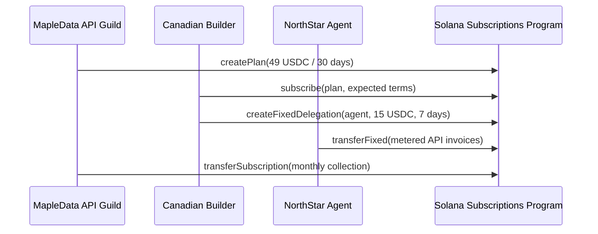

# Architecture

This demo models a Canadian AI-agent API product called **Maple Meter**.

The design uses Solana native subscriptions and allowances in two complementary ways:

1. A merchant publishes a subscription plan for a monthly API tier.
2. A builder subscribes to the plan and snapshots the billing terms.
3. The builder grants a fixed allowance to an AI-agent worker for metered endpoint calls.
4. The merchant billing worker collects the monthly subscription charge.
5. The AI agent can spend only within the fixed allowance cap and expiry window.

The important safety property is separation of controls:

- The merchant plan handles predictable subscription revenue.
- The fixed allowance handles bounded autonomous agent spend.
- The subscription terms are snapshotted, so a merchant cannot silently mutate the price for an existing subscriber.
- The agent allowance expires and has a hard cap, so a compromised agent cannot drain the user's full balance.

This pattern is useful for:

- pay-as-you-go API gateways
- data vendors serving AI agents
- usage-capped developer tools
- Canadian SaaS builders that want stablecoin settlement without a centralized billing layer
